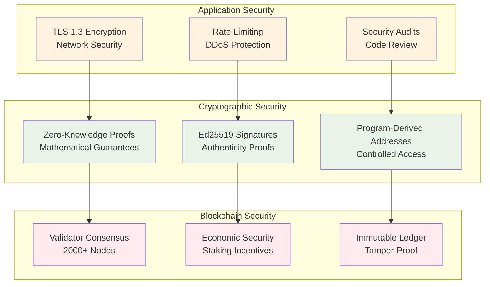
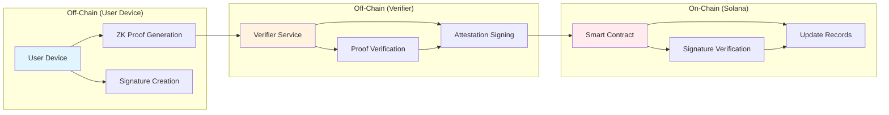
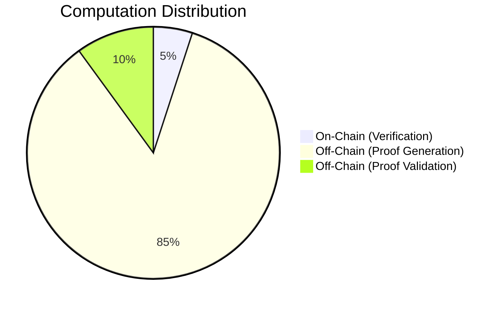
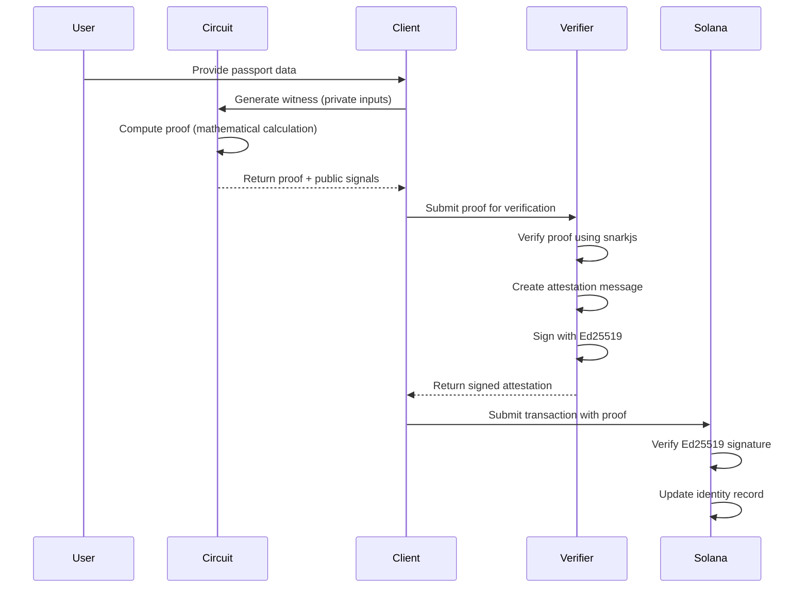
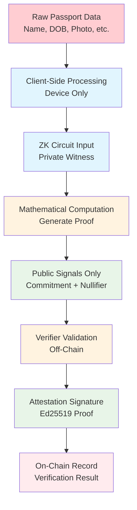
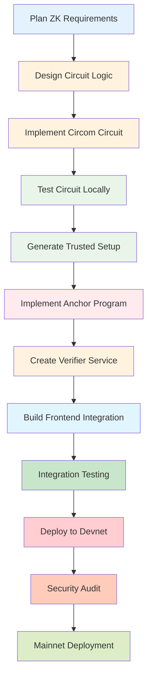

# Zassport Security & Privacy Deep Dive

## Overview

This document provides a comprehensive explanation of Zassport's security architecture, privacy mechanisms, and how zero-knowledge proofs work with Solana and Anchor. We'll break down complex concepts with examples and visual diagrams to help you understand how your data remains private and secure throughout the entire process.

---

## 1. How Zassport is Purely Secure

### Security Foundations

Zassport's security is built on multiple layers of cryptographic guarantees:

#### 1.1 Zero-Knowledge Proofs (ZKPs)
- **What**: Mathematical proofs that verify statements without revealing the underlying data
- **How**: Uses Circom circuits compiled to Groth16 proofs
- **Security**: Based on well-studied cryptographic assumptions (discrete logarithm problem)

#### 1.2 Ed25519 Digital Signatures
- **What**: Cryptographic signatures that prove authenticity without revealing secrets
- **How**: Verifier service signs attestations using Ed25519 private keys
- **Security**: 128-bit security level, widely used in blockchain

#### 1.3 Solana's Security Model
- **What**: High-throughput blockchain with economic security through staking
- **How**: 2000+ validator nodes secure the network
- **Security**: Economic incentives prevent attacks (51% attack costs millions)

#### 1.4 Program-Derived Addresses (PDAs)
- **What**: Deterministic addresses controlled by programs, not users
- **How**: Identity accounts use PDAs for secure, predictable addressing
- **Security**: Only the program can modify PDA-controlled accounts

### Security Architecture Diagram



### Example: Age Verification Security

**Traditional System**:
```
User → Service: "I am 25 years old"
Service → Database: Store "User is 25"
Result: Age data stored forever, vulnerable to breaches
```

**Zassport System**:
```
User → ZK Proof: Prove "Age ≥ 18" without revealing actual age
Verifier → Attestation: Sign proof validity
Blockchain → Record: Only "age_verified: true" stored
Result: No age data stored, only verification result
```

---

## 2. Off-Chain vs On-Chain: Architecture & Trade-offs

### What is Off-Chain vs On-Chain?

#### On-Chain Components
- **Smart Contracts**: Solana programs that execute on blockchain
- **Identity Records**: Commitment/nullifier hashes stored on-chain
- **Verification Results**: Boolean flags (age_verified, nationality_verified)
- **Governance**: Proposals and votes recorded immutably

#### Off-Chain Components
- **ZK Proof Generation**: Client-side computation using Circom circuits
- **Proof Verification**: Verifier service validates proofs without blockchain
- **Attestation Signing**: Ed25519 signatures created off-chain
- **Raw Passport Data**: Never leaves user's device

### Architecture Flow



### Pros and Cons Comparison

#### On-Chain Advantages
✅ **Security**: Immutable, cryptographically secure
✅ **Transparency**: Publicly verifiable
✅ **Decentralization**: No single point of failure
✅ **Finality**: Permanent records

#### On-Chain Disadvantages
❌ **Cost**: High transaction fees (Solana: ~$0.0001/tx)
❌ **Speed**: Limited by block time (~400ms on Solana)
❌ **Scalability**: Network congestion possible
❌ **Privacy**: Public ledger (but we only store hashes)

#### Off-Chain Advantages
✅ **Speed**: Instant computation
✅ **Cost**: Free or low-cost processing
✅ **Scalability**: Unlimited parallel processing
✅ **Privacy**: Data never hits public networks

#### Off-Chain Disadvantages
❌ **Trust**: Requires trusting the off-chain service
❌ **Availability**: Service downtime affects functionality
❌ **Security**: Dependent on service security
❌ **Verification**: Needs on-chain confirmation

### Zassport's Hybrid Approach



**Why This Works**:
- **Heavy computation** (ZK proof generation) happens off-chain for speed
- **Critical verification** (signature checks) happens on-chain for security
- **Trust minimization** through cryptographic proofs and attestations

---

## 3. How ZK Works with Anchor & Solana

### ZK Proof Lifecycle



### Technical Integration Details

#### 1. Circom Circuit → Anchor Integration
```rust
// Anchor instruction that receives ZK proof
#[derive(Accounts)]
pub struct AttestAge<'info> {
    #[account(mut)]
    pub identity: Account<'info, Identity>,
    
    /// CHECK: Verified via signature
    pub verifier: AccountInfo<'info>,
    
    pub system_program: Program<'info, System>,
}

#[instruction(min_age: u64, timestamp: u64)]
pub fn attest_age(ctx: Context<AttestAge>, min_age: u64, timestamp: u64) -> Result<()> {
    // Verify Ed25519 signature from verifier service
    // Update identity.age_verified = true
    Ok(())
}
```

#### 2. ZK Proof Structure
```typescript
interface ZKProof {
  proof: {
    pi_a: [string, string],
    pi_b: [[string, string], [string, string]],
    pi_c: [string, string]
  },
  publicSignals: [
    commitment,    // Hash of passport data
    nullifier,     // Prevents double-spending
    minAge,        // Public parameter
    currentTime    // Timestamp
  ]
}
```

#### 3. Message Signing for Attestation
```javascript
// Verifier service creates signed attestation
const message = Buffer.concat([
  Buffer.from("ZASSPORT|AGE|v1"),
  programId.toBuffer(),      // Solana program ID
  owner.toBuffer(),          // User's wallet
  identity.toBuffer(),       // Identity account
  commitment,                // From ZK proof
  nullifier,                 // From ZK proof
  minAgeBuffer,              // Age requirement
  timestampBuffer            // Current time
]);

const signature = ed25519.sign(message, privateKey);
```

### How ZK Provides Privacy

#### Commitment Scheme
- **Input**: Raw passport data (name, DOB, nationality, etc.)
- **Process**: Hash all data into a single commitment
- **Output**: 32-byte hash stored on-chain
- **Privacy**: Impossible to reverse-engineer original data from hash

#### Nullifier System
- **Purpose**: Prevent double-spending of identities
- **How**: Each proof includes a unique nullifier
- **Security**: Once used, nullifier is recorded; prevents reuse

#### Zero-Knowledge Property
- **Prover**: Knows secret data, proves statements about it
- **Verifier**: Confirms proof validity without learning secrets
- **Example**: Prove "I am over 18" without revealing birthdate

---

## 4. Cross-Checking Data Privacy

### How to Verify Your Data Isn't Revealed

#### 1. Check On-Chain Records
```bash
# Query Solana blockchain for your identity account
solana account <YOUR_IDENTITY_ADDRESS> --output json

# Expected output: Only hashes and boolean flags
{
  "authority": "YourWalletAddress",
  "commitment": "32-byte-hash-of-your-data",
  "nullifier": "32-byte-nullifier-hash", 
  "verified_at": 1234567890,
  "reputation": 100,
  "age_verified": true,
  "nationality_verified": false,
  "bump": 255
}
```

#### 2. Inspect Transaction Data
```bash
# Check transaction details
solana confirm <TRANSACTION_SIGNATURE> --output json

# Verify only public parameters are visible
# No passport data, names, or personal information
```

#### 3. Monitor Network Traffic
```javascript
// Use browser dev tools to inspect network requests
// During proof generation: Only ZK proof sent to verifier
// No raw passport data in HTTP requests
```

#### 4. Verify Proof Generation
```typescript
// Check that proof generation happens locally
console.log("Generating proof on device...");
const proof = await generateProof(passportData); // Local computation
console.log("Proof generated, sending to verifier...");
// Only proof sent, not passportData
```

### Privacy Verification Checklist

- [ ] **On-Chain Data**: Only contains hashes and verification flags
- [ ] **Network Traffic**: No personal data transmitted
- [ ] **Local Storage**: Passport data never leaves device
- [ ] **Proof Verification**: Mathematical guarantees, not trust
- [ ] **Attestation Signing**: Cryptographic proof of validity

---

## 5. How Data is Private & Confidential

### Data Processing Flow



### Step-by-Step Privacy Protection

#### Step 1: Data Input (Device-Local)
- **Location**: User's phone/tablet/computer
- **Processing**: Raw passport data scanned via NFC or entered manually
- **Storage**: Temporary memory only, never persisted
- **Privacy**: Data never leaves device

#### Step 2: ZK Proof Generation
- **Input**: Passport data + secret randomness
- **Computation**: Circom circuit calculates mathematical proof
- **Output**: Proof + public signals (commitment, nullifier)
- **Privacy**: Original data "forgotten" after proof generation

#### Step 3: Proof Transmission
- **Data Sent**: Only cryptographic proof (not passport data)
- **Destination**: Verifier service
- **Encryption**: TLS 1.3 end-to-end
- **Privacy**: No identifiable information transmitted

#### Step 4: Off-Chain Verification
- **Process**: Verifier checks proof mathematical validity
- **Data Access**: Only sees proof structure, not contents
- **Result**: Signs attestation if proof is valid
- **Privacy**: Verifier learns nothing about passport data

#### Step 5: On-Chain Recording
- **Data Stored**: Only verification result (boolean flag)
- **Public View**: Anyone can see "user X is age-verified"
- **Private Data**: Never stored or visible
- **Privacy**: Maximum transparency with minimum disclosure

### Real-World Example

**Alice wants to prove she's over 18 to access a DeFi service:**

1. **Alice's Device**: Scans passport with NFC
   - Data: "Alice Smith, DOB: 1990-01-01, Nationality: US"
   - Processing: Local ZK proof generation
   - Output: Proof that "age ≥ 18" without revealing actual age

2. **Network Transmission**: 
   - Sent: Cryptographic proof (mathematical values)
   - Not Sent: Name, DOB, nationality, photo

3. **Verifier Service**:
   - Receives: Proof data
   - Computes: Mathematical verification
   - Learns: Proof is valid (but nothing about Alice's data)
   - Signs: Attestation confirming validity

4. **Solana Blockchain**:
   - Records: "Alice's identity is age-verified"
   - Stores: Only cryptographic hashes and boolean flags
   - Public: Anyone can verify the attestation was signed by authorized verifier

5. **DeFi Service**:
   - Checks: On-chain record shows age verification
   - Grants: Access without knowing Alice's actual age

### Privacy Guarantees

#### 1. **Zero Data Leakage**
- Raw passport data never transmitted
- Only mathematical proofs sent over network
- On-chain storage contains only verification results

#### 2. **Forward Secrecy**
- Each proof uses unique randomness
- Previous proofs don't help guess future ones
- Compromised proof doesn't reveal other data

#### 3. **Unlinkability**
- Multiple proofs from same person are unlinkable
- No correlation between different verifications
- Privacy preserved across services

#### 4. **Minimal Disclosure**
- Prove only what's necessary (age ≥ 18, not exact age)
- Selective disclosure capabilities
- User controls what attributes to prove

---

## 6. Development Guide: Building with Solana Anchor & ZK

### Overview

This section provides a comprehensive guide for building privacy-preserving applications using Solana, Anchor, and zero-knowledge proofs. Zassport's development process follows a specific pattern that ensures security, scalability, and maintainability.

### Development Environment Setup

#### Prerequisites
```bash
# Install Solana CLI
sh -c "$(curl -sSfL https://release.solana.com/v1.18.4/install)"

# Install Anchor
cargo install --git https://github.com/coral-xyz/anchor avm --locked --force
avm install latest
avm use latest

# Install Node.js dependencies
npm install -g @project-serum/anchor-cli
npm install -g circom snarkjs

# Install Rust toolchain
curl --proto '=https' --tlsv1.2 -sSf https://sh.rustup.rs | sh
```

#### Project Structure
```
zk-solana-project/
├── programs/                    # Anchor programs
│   └── zk-program/
│       ├── src/
│       │   ├── lib.rs          # Main program logic
│       │   ├── instructions/   # Instruction handlers
│       │   └── state/          # Account structures
│       ├── Cargo.toml
│       └── Xargo.toml
├── circuits/                    # ZK circuits
│   ├── age_proof/
│   │   ├── circuit.circom      # ZK circuit
│   │   ├── input.json          # Test inputs
│   │   └── out/                # Compiled artifacts
│   └── scripts/                # Build scripts
├── tests/                       # Integration tests
├── app/                         # Frontend application
├── verifier/                    # Off-chain verifier service
├── migrations/                  # Deployment scripts
├── Anchor.toml                  # Anchor configuration
├── package.json                 # Node dependencies
└── tsconfig.json               # TypeScript config
```

### Development Workflow



### Phase 1: ZK Circuit Development

#### Step 1: Define Privacy Requirements
```typescript
// Define what you want to prove without revealing
interface PrivacyRequirements {
  // Prove age >= 18 without revealing birthdate
  ageThreshold: number;
  
  // Prove nationality without revealing passport details
  allowedNationalities: string[];
  
  // Prove credential validity without revealing contents
  credentialFields: string[];
}
```

#### Step 2: Design Circuit Architecture
```circom
pragma circom 2.0.0;

template AgeProof() {
    // Private inputs (user's secret data)
    signal input birthdate;        // User's actual birthdate
    signal input currentTime;      // Current timestamp
    signal input randomness;       // Random salt for commitment
    
    // Public inputs (verifier needs to know)
    signal input minAge;           // Age requirement (e.g., 18)
    signal input commitment;       // Hash of all user data
    
    // Public outputs
    signal output ageValid;        // Boolean result
    signal output nullifier;       // Prevents double-spending
    
    // Circuit logic
    // 1. Calculate age from birthdate
    // 2. Check age >= minAge
    // 3. Generate commitment hash
    // 4. Create nullifier
}
```

#### Step 3: Implement Circuit Logic
```circom
// Age calculation component
template CalculateAge() {
    signal input birthdate;
    signal input currentTime;
    signal output age;
    
    // Convert timestamps to years
    age <-- (currentTime - birthdate) / 31536000; // seconds in year
}

// Commitment generation
template Commitment() {
    signal input data[10];    // Array of passport fields
    signal input randomness;
    signal output commitment;
    
    // Poseidon hash of all data + randomness
    commitment <== Poseidon(10)(data, randomness);
}
```

#### Step 4: Compile and Test Circuit
```bash
# Compile circuit
circom circuits/age_proof/circuit.circom --r1cs --wasm --sym

# Generate trusted setup (development only)
snarkjs groth16 setup circuit.r1cs pot12_final.ptau circuit_final.zkey

# Export verification key
snarkjs zkey export verificationkey circuit_final.zkey verification_key.json

# Generate Solidity verifier (optional)
snarkjs zkey export solidityverifier circuit_final.zkey verifier.sol
```

### Phase 2: Anchor Program Development

#### Step 1: Define Account Structures
```rust
use anchor_lang::prelude::*;

#[account]
pub struct Identity {
    pub authority: Pubkey,           // User's wallet
    pub commitment: [u8; 32],       // ZK commitment hash
    pub nullifier: [u8; 32],        // Nullifier for double-spend prevention
    pub verified_at: i64,           // Timestamp of verification
    pub reputation: u64,            // Governance reputation score
    pub age_verified: bool,         // Age verification status
    pub nationality_verified: bool, // Nationality verification status
    pub bump: u8,                   // PDA bump
}

#[account]
pub struct VerifierConfig {
    pub authority: Pubkey,          // Admin authority
    pub verifier: Pubkey,           // Verifier service pubkey
    pub bump: u8,
}
```

#### Step 2: Implement Instructions
```rust
#[derive(Accounts)]
#[instruction(commitment: [u8; 32], nullifier: [u8; 32])]
pub struct RegisterIdentity<'info> {
    #[account(
        init,
        payer = authority,
        space = 8 + Identity::LEN,
        seeds = [b"identity", authority.key().as_ref()],
        bump
    )]
    pub identity: Account<'info, Identity>,
    
    #[account(mut)]
    pub authority: Signer<'info>,
    
    pub system_program: Program<'info, System>,
}

#[instruction(min_age: u64, timestamp: i64)]
pub struct AttestAge<'info> {
    #[account(mut)]
    pub identity: Account<'info, Identity>,
    
    /// CHECK: Verified via Ed25519 signature
    pub verifier: AccountInfo<'info>,
    
    pub system_program: Program<'info, System>,
}
```

#### Step 3: Ed25519 Signature Verification
```rust
pub fn attest_age(
    ctx: Context<AttestAge>,
    min_age: u64,
    timestamp: i64
) -> Result<()> {
    // Build expected message
    let mut message = Vec::new();
    message.extend_from_slice(b"ZASSPORT|AGE|v1");
    message.extend_from_slice(&ctx.accounts.identity.commitment);
    message.extend_from_slice(&ctx.accounts.identity.nullifier);
    message.extend_from_slice(&min_age.to_le_bytes());
    message.extend_from_slice(&timestamp.to_le_bytes());
    
    // Verify Ed25519 signature using sysvar
    let ix = &ctx.accounts.verifier;
    let signature = ix.data[0..64].try_into().unwrap();
    let pubkey = ix.data[64..96].try_into().unwrap();
    
    // Verify signature matches expected message
    require!(
        ed25519_program::verify(&signature, &pubkey, &message),
        ZkError::InvalidSignature
    );
    
    // Update identity record
    let identity = &mut ctx.accounts.identity;
    identity.age_verified = true;
    identity.verified_at = timestamp;
    
    Ok(())
}
```

### Phase 3: Verifier Service Implementation

#### Step 1: Express.js Server Setup
```javascript
const express = require('express');
const snarkjs = require('snarkjs');
const ed25519 = require('ed25519');
const app = express();

app.use(express.json());
app.use(cors());

// Load verification key
const vKey = JSON.parse(fs.readFileSync('verification_key.json'));

// Load private key for signing
const privateKey = process.env.VERIFIER_PRIVATE_KEY;
const publicKey = ed25519.publicKey(privateKey);
```

#### Step 2: Proof Verification Endpoint
```javascript
app.post('/verify-age', async (req, res) => {
    try {
        const { proof, publicSignals } = req.body;
        
        // Verify ZK proof
        const isValid = await snarkjs.groth16.verify(vKey, publicSignals, proof);
        
        if (!isValid) {
            return res.status(400).json({ error: 'Invalid proof' });
        }
        
        // Extract public signals
        const [commitment, nullifier, minAge, timestamp] = publicSignals;
        
        // Build attestation message
        const message = Buffer.concat([
            Buffer.from("ZASSPORT|AGE|v1"),
            Buffer.from(commitment, 'hex'),
            Buffer.from(nullifier, 'hex'),
            Buffer.from(minAge.toString(16).padStart(16, '0'), 'hex'),
            Buffer.from(timestamp.toString(16).padStart(16, '0'), 'hex')
        ]);
        
        // Sign attestation
        const signature = ed25519.sign(message, privateKey);
        
        res.json({
            valid: true,
            attestation: {
                message: message.toString('hex'),
                signature: signature.toString('hex'),
                verifierPublicKey: publicKey.toString('hex'),
                minAge: parseInt(minAge),
                timestamp: parseInt(timestamp)
            }
        });
        
    } catch (error) {
        res.status(500).json({ error: error.message });
    }
});
```

### Phase 4: Frontend Integration

#### Step 1: Proof Generation Component
```typescript
import { groth16 } from 'snarkjs';
import { buildPoseidon } from 'circomlibjs';

export class ZKProofGenerator {
    private poseidon: any;
    
    async init() {
        this.poseidon = await buildPoseidon();
    }
    
    async generateAgeProof(
        birthdate: number,
        minAge: number,
        passportData: any
    ) {
        // Calculate age
        const currentTime = Math.floor(Date.now() / 1000);
        const age = Math.floor((currentTime - birthdate) / 31536000);
        
        // Generate commitment
        const preimage = [
            ...Object.values(passportData),
            Math.random() // randomness
        ];
        const commitment = this.poseidon.F.toString(
            this.poseidon(preimage)
        );
        
        // Generate nullifier
        const nullifier = this.poseidon.F.toString(
            this.poseidon([commitment, Math.random()])
        );
        
        // Generate proof
        const { proof, publicSignals } = await groth16.fullProve(
            {
                birthdate,
                currentTime,
                randomness: Math.random(),
                commitment,
                nullifier,
                minAge
            },
            "circuits/age_proof/circuit.wasm",
            "circuits/age_proof/circuit_final.zkey"
        );
        
        return { proof, publicSignals };
    }
}
```

#### Step 2: Solana Transaction Submission
```typescript
import { Connection, PublicKey, Transaction } from '@solana/web3.js';
import { Program, AnchorProvider, web3 } from '@project-serum/anchor';

export class ZassportClient {
    private program: Program;
    private connection: Connection;
    
    async attestAge(
        identityAddress: PublicKey,
        minAge: number,
        attestation: any
    ) {
        // Create Ed25519 pre-instruction
        const preInstruction = web3.Ed25519Program.createInstructionWithPublicKey({
            publicKey: new PublicKey(attestation.verifierPublicKey),
            message: Buffer.from(attestation.message, 'hex'),
            signature: Buffer.from(attestation.signature, 'hex'),
        });
        
        // Create attest instruction
        const tx = await this.program.methods
            .attestAge(minAge, new BN(attestation.timestamp))
            .accounts({
                identity: identityAddress,
                verifier: preInstruction.programId,
            })
            .preInstructions([preInstruction])
            .transaction();
        
        // Send transaction
        const signature = await this.program.provider.sendAndConfirm(tx);
        return signature;
    }
}
```

### Phase 5: Testing Strategy

#### Unit Tests (Circuits)
```javascript
const { assert } = require('chai');
const snarkjs = require('snarkjs');

describe('Age Proof Circuit', () => {
    it('should verify valid age proof', async () => {
        const birthdate = Math.floor(new Date('1990-01-01').getTime() / 1000);
        const currentTime = Math.floor(Date.now() / 1000);
        
        const input = {
            birthdate,
            currentTime,
            minAge: 18,
            randomness: 12345
        };
        
        const { proof, publicSignals } = await snarkjs.groth16.fullProve(
            input,
            "circuit.wasm",
            "circuit_final.zkey"
        );
        
        const isValid = await snarkjs.groth16.verify(
            vKey,
            publicSignals,
            proof
        );
        
        assert.isTrue(isValid);
    });
});
```

#### Integration Tests (Anchor)
```typescript
import * as anchor from '@project-serum/anchor';
import { PublicKey } from '@solana/web3.js';

describe('Zassport Program', () => {
    const provider = anchor.AnchorProvider.env();
    anchor.setProvider(provider);
    
    const program = anchor.workspace.Zassport as Program<Zassport>;
    
    it('should register identity', async () => {
        const commitment = new Uint8Array(32).fill(1);
        const nullifier = new Uint8Array(32).fill(2);
        
        const [identityPDA] = PublicKey.findProgramAddressSync(
            [Buffer.from('identity'), provider.wallet.publicKey.toBuffer()],
            program.programId
        );
        
        await program.methods
            .registerIdentity(commitment, nullifier)
            .accounts({
                identity: identityPDA,
                authority: provider.wallet.publicKey,
                systemProgram: web3.SystemProgram.programId,
            })
            .rpc();
        
        const identity = await program.account.identity.fetch(identityPDA);
        assert.deepEqual(identity.commitment, commitment);
    });
});
```

### Phase 6: Deployment Process

#### Devnet Deployment
```bash
# Build and deploy Anchor program
anchor build
anchor deploy --provider.cluster devnet

# Update program ID in all configurations
# Update verifier service with new program ID
# Update frontend with new program ID

# Deploy verifier service
cd verifier
npm run build
npm run start:devnet
```

#### Production Deployment
```bash
# Mainnet deployment
anchor build -- --release
anchor deploy --provider.cluster mainnet

# Update DNS and SSL certificates
# Configure monitoring and alerts
# Set up backup and recovery procedures

# Security audit
# Penetration testing
# Formal verification of circuits
```

### Best Practices & Patterns

#### 1. Security Patterns
- **Domain Separation**: Use unique prefixes for all messages
- **Freshness**: Include timestamps to prevent replay attacks
- **Rate Limiting**: Prevent DoS attacks on verifier service
- **Input Validation**: Validate all inputs on both client and server

#### 2. ZK Development Patterns
- **Minimal Disclosure**: Prove only what's necessary
- **Efficient Circuits**: Minimize constraints for better performance
- **Trusted Setup**: Use proper ceremony for production circuits
- **Circuit Reusability**: Design circuits for multiple use cases

#### 3. Solana Integration Patterns
- **PDA Usage**: Use PDAs for deterministic account addresses
- **Account Validation**: Proper account size calculation and validation
- **Error Handling**: Comprehensive error types and messages
- **Gas Optimization**: Minimize transaction size and computation

#### 4. Testing Patterns
- **Circuit Testing**: Test all edge cases in circuits
- **Integration Testing**: End-to-end workflow testing
- **Security Testing**: Attempt to break the system
- **Performance Testing**: Measure proof generation and verification times

### Common Pitfalls & Solutions

#### 1. Circuit Compilation Issues
```bash
# Solution: Check template parameters
circom --version  # Ensure compatible version
# Use --O1 optimization for production
circom circuit.circom --r1cs --wasm --sym --O1
```

#### 2. Proof Verification Failures
```javascript
// Debug: Log intermediate values
console.log('Public signals:', publicSignals);
console.log('Proof structure:', proof);

// Check: Ensure correct vKey format
const vKey = JSON.parse(fs.readFileSync('verification_key.json'));
```

#### 3. Signature Verification Issues
```rust
// Debug: Log message construction
msg!("Message length: {}", message.len());
msg!("Expected message: {:?}", message);

// Check: Ensure correct byte order (little-endian for numbers)
```

#### 4. Transaction Failures
```typescript
// Debug: Simulate transaction first
const simulated = await connection.simulateTransaction(tx);
console.log('Simulation logs:', simulated.value.logs);

// Check: Account permissions and data sizes
```

### Performance Optimization

#### Circuit Optimization
- **Constraint Reduction**: Minimize arithmetic operations
- **Parallel Computation**: Use independent sub-circuits
- **Lookup Tables**: Pre-compute expensive operations

#### On-Chain Optimization
- **Account Size**: Minimize account sizes
- **Instruction Batching**: Combine multiple operations
- **PDA Pre-computation**: Avoid runtime PDA calculations

#### Off-Chain Optimization
- **Caching**: Cache verification keys and proofs
- **Parallel Processing**: Handle multiple requests concurrently
- **CDN**: Distribute circuit files via CDN

### Monitoring & Maintenance

#### Key Metrics to Track
- **Proof Generation Time**: Client-side performance
- **Verification Time**: Server-side performance
- **Transaction Success Rate**: On-chain reliability
- **Error Rates**: System health indicators

#### Logging Strategy
```javascript
// Structured logging
logger.info('Proof verification completed', {
    proofId: generateId(),
    verificationTime: Date.now(),
    circuitType: 'age_proof',
    success: true
});
```

This development guide provides a complete roadmap for building production-ready ZK applications on Solana. Following these patterns ensures security, scalability, and maintainability of your privacy-preserving system.

---

*This guide is based on Zassport's development experience. Adapt these patterns to your specific use case while maintaining security best practices.*</content>
