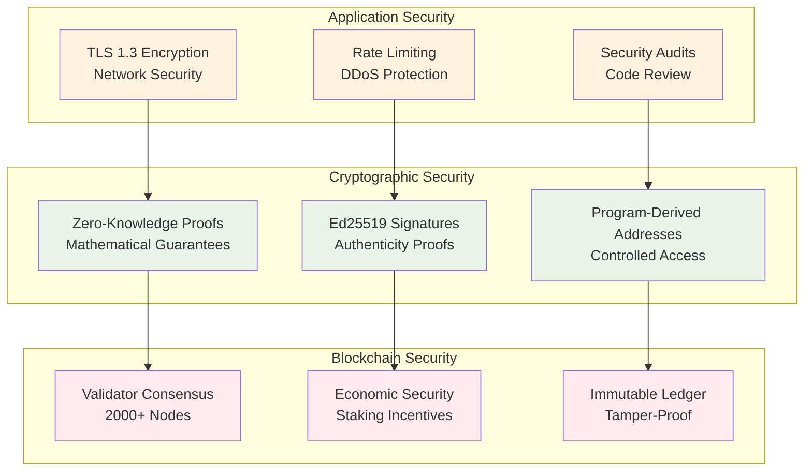
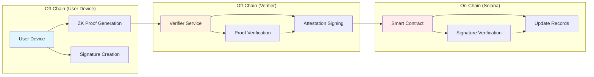
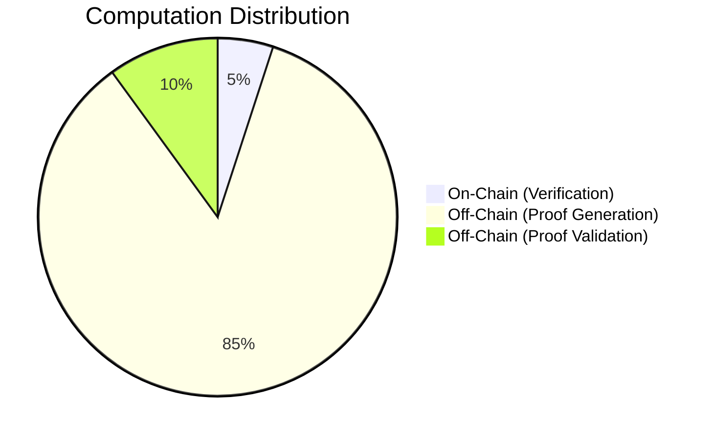
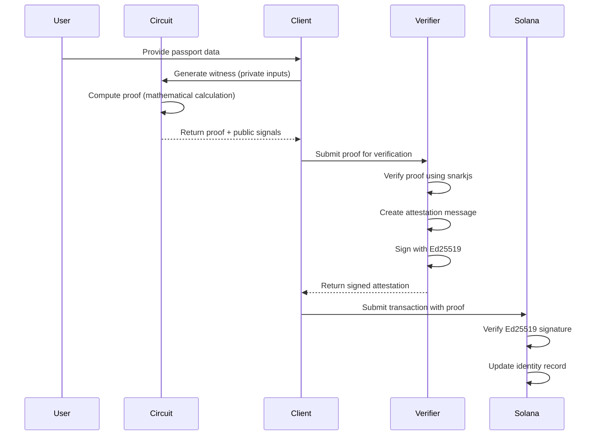
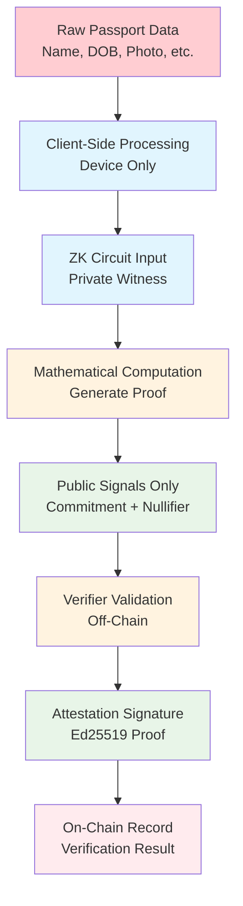

# Zassport Security & Privacy Deep Dive

## Overview

This document provides a comprehensive explanation of Zassport's security architecture, privacy mechanisms, and how zero-knowledge proofs work with Solana and Anchor. We'll break down complex concepts with examples and visual diagrams to help you understand how your data remains private and secure throughout the entire process.

---

## 1. How Zassport is Purely Secure

### Security Foundations

Zassport's security is built on multiple layers of cryptographic guarantees:

#### 1.1 Zero-Knowledge Proofs (ZKPs)
- **What**: Mathematical proofs that verify statements without revealing the underlying data
- **How**: Uses Circom circuits compiled to Groth16 proofs
- **Security**: Based on well-studied cryptographic assumptions (discrete logarithm problem)

#### 1.2 Ed25519 Digital Signatures
- **What**: Cryptographic signatures that prove authenticity without revealing secrets
- **How**: Verifier service signs attestations using Ed25519 private keys
- **Security**: 128-bit security level, widely used in blockchain

#### 1.3 Solana's Security Model
- **What**: High-throughput blockchain with economic security through staking
- **How**: 2000+ validator nodes secure the network
- **Security**: Economic incentives prevent attacks (51% attack costs millions)

#### 1.4 Program-Derived Addresses (PDAs)
- **What**: Deterministic addresses controlled by programs, not users
- **How**: Identity accounts use PDAs for secure, predictable addressing
- **Security**: Only the program can modify PDA-controlled accounts

### Security Architecture Diagram



### Example: Age Verification Security

**Traditional System**:
```
User → Service: "I am 25 years old"
Service → Database: Store "User is 25"
Result: Age data stored forever, vulnerable to breaches
```

**Zassport System**:
```
User → ZK Proof: Prove "Age ≥ 18" without revealing actual age
Verifier → Attestation: Sign proof validity
Blockchain → Record: Only "age_verified: true" stored
Result: No age data stored, only verification result
```

---

## 2. Off-Chain vs On-Chain: Architecture & Trade-offs

### What is Off-Chain vs On-Chain?

#### On-Chain Components
- **Smart Contracts**: Solana programs that execute on blockchain
- **Identity Records**: Commitment/nullifier hashes stored on-chain
- **Verification Results**: Boolean flags (age_verified, nationality_verified)
- **Governance**: Proposals and votes recorded immutably

#### Off-Chain Components
- **ZK Proof Generation**: Client-side computation using Circom circuits
- **Proof Verification**: Verifier service validates proofs without blockchain
- **Attestation Signing**: Ed25519 signatures created off-chain
- **Raw Passport Data**: Never leaves user's device

### Architecture Flow



### Pros and Cons Comparison

#### On-Chain Advantages
✅ **Security**: Immutable, cryptographically secure
✅ **Transparency**: Publicly verifiable
✅ **Decentralization**: No single point of failure
✅ **Finality**: Permanent records

#### On-Chain Disadvantages
❌ **Cost**: High transaction fees (Solana: ~$0.0001/tx)
❌ **Speed**: Limited by block time (~400ms on Solana)
❌ **Scalability**: Network congestion possible
❌ **Privacy**: Public ledger (but we only store hashes)

#### Off-Chain Advantages
✅ **Speed**: Instant computation
✅ **Cost**: Free or low-cost processing
✅ **Scalability**: Unlimited parallel processing
✅ **Privacy**: Data never hits public networks

#### Off-Chain Disadvantages
❌ **Trust**: Requires trusting the off-chain service
❌ **Availability**: Service downtime affects functionality
❌ **Security**: Dependent on service security
❌ **Verification**: Needs on-chain confirmation

### Zassport's Hybrid Approach



**Why This Works**:
- **Heavy computation** (ZK proof generation) happens off-chain for speed
- **Critical verification** (signature checks) happens on-chain for security
- **Trust minimization** through cryptographic proofs and attestations

---

## 3. How ZK Works with Anchor & Solana

### ZK Proof Lifecycle



### Technical Integration Details

#### 1. Circom Circuit → Anchor Integration
```rust
// Anchor instruction that receives ZK proof
#[derive(Accounts)]
pub struct AttestAge<'info> {
    #[account(mut)]
    pub identity: Account<'info, Identity>,
    
    /// CHECK: Verified via signature
    pub verifier: AccountInfo<'info>,
    
    pub system_program: Program<'info, System>,
}

#[instruction(min_age: u64, timestamp: u64)]
pub fn attest_age(ctx: Context<AttestAge>, min_age: u64, timestamp: u64) -> Result<()> {
    // Verify Ed25519 signature from verifier service
    // Update identity.age_verified = true
    Ok(())
}
```

#### 2. ZK Proof Structure
```typescript
interface ZKProof {
  proof: {
    pi_a: [string, string],
    pi_b: [[string, string], [string, string]],
    pi_c: [string, string]
  },
  publicSignals: [
    commitment,    // Hash of passport data
    nullifier,     // Prevents double-spending
    minAge,        // Public parameter
    currentTime    // Timestamp
  ]
}
```

#### 3. Message Signing for Attestation
```javascript
// Verifier service creates signed attestation
const message = Buffer.concat([
  Buffer.from("ZASSPORT|AGE|v1"),
  programId.toBuffer(),      // Solana program ID
  owner.toBuffer(),          // User's wallet
  identity.toBuffer(),       // Identity account
  commitment,                // From ZK proof
  nullifier,                 // From ZK proof
  minAgeBuffer,              // Age requirement
  timestampBuffer            // Current time
]);

const signature = ed25519.sign(message, privateKey);
```

### How ZK Provides Privacy

#### Commitment Scheme
- **Input**: Raw passport data (name, DOB, nationality, etc.)
- **Process**: Hash all data into a single commitment
- **Output**: 32-byte hash stored on-chain
- **Privacy**: Impossible to reverse-engineer original data from hash

#### Nullifier System
- **Purpose**: Prevent double-spending of identities
- **How**: Each proof includes a unique nullifier
- **Security**: Once used, nullifier is recorded; prevents reuse

#### Zero-Knowledge Property
- **Prover**: Knows secret data, proves statements about it
- **Verifier**: Confirms proof validity without learning secrets
- **Example**: Prove "I am over 18" without revealing birthdate

---

## 4. Cross-Checking Data Privacy

### How to Verify Your Data Isn't Revealed

#### 1. Check On-Chain Records
```bash
# Query Solana blockchain for your identity account
solana account <YOUR_IDENTITY_ADDRESS> --output json

# Expected output: Only hashes and boolean flags
{
  "authority": "YourWalletAddress",
  "commitment": "32-byte-hash-of-your-data",
  "nullifier": "32-byte-nullifier-hash", 
  "verified_at": 1234567890,
  "reputation": 100,
  "age_verified": true,
  "nationality_verified": false,
  "bump": 255
}
```

#### 2. Inspect Transaction Data
```bash
# Check transaction details
solana confirm <TRANSACTION_SIGNATURE> --output json

# Verify only public parameters are visible
# No passport data, names, or personal information
```

#### 3. Monitor Network Traffic
```javascript
// Use browser dev tools to inspect network requests
// During proof generation: Only ZK proof sent to verifier
// No raw passport data in HTTP requests
```

#### 4. Verify Proof Generation
```typescript
// Check that proof generation happens locally
console.log("Generating proof on device...");
const proof = await generateProof(passportData); // Local computation
console.log("Proof generated, sending to verifier...");
// Only proof sent, not passportData
```

### Privacy Verification Checklist

- [ ] **On-Chain Data**: Only contains hashes and verification flags
- [ ] **Network Traffic**: No personal data transmitted
- [ ] **Local Storage**: Passport data never leaves device
- [ ] **Proof Verification**: Mathematical guarantees, not trust
- [ ] **Attestation Signing**: Cryptographic proof of validity

---

## 5. How Data is Private & Confidential

### Data Processing Flow



### Step-by-Step Privacy Protection

#### Step 1: Data Input (Device-Local)
- **Location**: User's phone/tablet/computer
- **Processing**: Raw passport data scanned via NFC or entered manually
- **Storage**: Temporary memory only, never persisted
- **Privacy**: Data never leaves device

#### Step 2: ZK Proof Generation
- **Input**: Passport data + secret randomness
- **Computation**: Circom circuit calculates mathematical proof
- **Output**: Proof + public signals (commitment, nullifier)
- **Privacy**: Original data "forgotten" after proof generation

#### Step 3: Proof Transmission
- **Data Sent**: Only cryptographic proof (not passport data)
- **Destination**: Verifier service
- **Encryption**: TLS 1.3 end-to-end
- **Privacy**: No identifiable information transmitted

#### Step 4: Off-Chain Verification
- **Process**: Verifier checks proof mathematical validity
- **Data Access**: Only sees proof structure, not contents
- **Result**: Signs attestation if proof is valid
- **Privacy**: Verifier learns nothing about passport data

#### Step 5: On-Chain Recording
- **Data Stored**: Only verification result (boolean flag)
- **Public View**: Anyone can see "user X is age-verified"
- **Private Data**: Never stored or visible
- **Privacy**: Maximum transparency with minimum disclosure

### Real-World Example

**Alice wants to prove she's over 18 to access a DeFi service:**

1. **Alice's Device**: Scans passport with NFC
   - Data: "Alice Smith, DOB: 1990-01-01, Nationality: US"
   - Processing: Local ZK proof generation
   - Output: Proof that "age ≥ 18" without revealing actual age

2. **Network Transmission**: 
   - Sent: Cryptographic proof (mathematical values)
   - Not Sent: Name, DOB, nationality, photo

3. **Verifier Service**:
   - Receives: Proof data
   - Computes: Mathematical verification
   - Learns: Proof is valid (but nothing about Alice's data)
   - Signs: Attestation confirming validity

4. **Solana Blockchain**:
   - Records: "Alice's identity is age-verified"
   - Stores: Only cryptographic hashes and boolean flags
   - Public: Anyone can verify the attestation was signed by authorized verifier

5. **DeFi Service**:
   - Checks: On-chain record shows age verification
   - Grants: Access without knowing Alice's actual age

### Privacy Guarantees

#### 1. **Zero Data Leakage**
- Raw passport data never transmitted
- Only mathematical proofs sent over network
- On-chain storage contains only verification results

#### 2. **Forward Secrecy**
- Each proof uses unique randomness
- Previous proofs don't help guess future ones
- Compromised proof doesn't reveal other data

#### 3. **Unlinkability**
- Multiple proofs from same person are unlinkable
- No correlation between different verifications
- Privacy preserved across services

#### 4. **Minimal Disclosure**
- Prove only what's necessary (age ≥ 18, not exact age)
- Selective disclosure capabilities
- User controls what attributes to prove

---

## Conclusion

Zassport achieves **true privacy-preserving identity verification** through:

1. **Pure Security**: Multiple cryptographic layers (ZK proofs, Ed25519, PDAs)
2. **Hybrid Architecture**: Off-chain efficiency + on-chain security
3. **ZK Integration**: Mathematical privacy guarantees with Solana
4. **Verifiable Privacy**: Transparent system where privacy can be independently verified
5. **Confidential Processing**: Data never leaves user device in identifiable form

The system proves that **privacy and usability can coexist** - you can verify identity attributes without revealing personal information, enabling a new paradigm of trust-minimized digital identity.

---

*This document explains the technical foundations of Zassport's privacy and security. For implementation details, see the main PROJECT_SUMMARY.md file.*</content>
<parameter name="filePath">/Users/kyto/zk/Zassport/SECURITY_PRIVACY_EXPLANATION.md